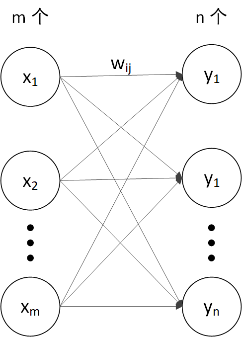

# 感知机

**简单情况**
$$
y= 
\begin{cases}
0& (w_1x_1 + w_2x_2)\leq \theta \\
1& (w_1x_1 + w_2x_2)>\theta
\end{cases}
$$

**特点**

* 输入输出信号为 0 或 1
* 不能自动调整权重 $w$

* 单层感知机相当于线性函数

**一般情况**
$$
\begin{bmatrix}
y_1 \\
y_2 \\
\vdots \\
y_n \\ 
\end{bmatrix}

=

\begin{bmatrix}
w_{11} & w_{12} & \cdots & w_{1m} \\
w_{21} & w_{22} & \cdots & w_{2m} \\
\vdots & \vdots &  & \vdots \\
w_{n1} & w_{n2} & \cdots & w_{nm} \\ 
\end{bmatrix}

\begin{bmatrix}
x_1 \\
x_2 \\
\vdots \\
x_n \\ 
\end{bmatrix}
$$

> $w$ 矩阵一行代表一个神经元的权重
>
> $n$ 行代表 $n$ 个神经元的权重

$$
y = wx
$$

