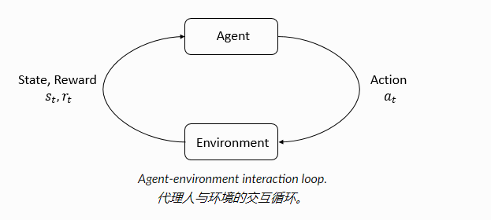
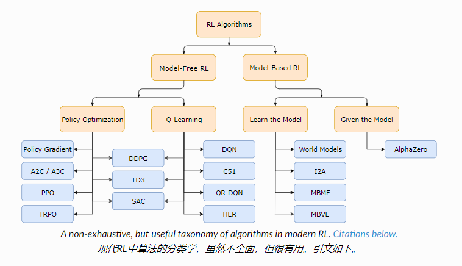

# Introduction to RL


## 关键概念


### Part 1: 关键概念和术语




agent 观测/部分观测 env 得到状态 s, 并作出动作 a, 环境收到动作影响发生变化到新的状态并给出反馈 r,  agent 的目标是最大化回报.


#### States and Observations

状态 s 是对环境信息的完整描述, 观测 o 是环境信息的部分描述


#### Action Spaces

环境中动作 a 的全集


#### Policies

策略是 agent 决定采取哪个动作 a 的规则

策略的参数用下标 θ 表示


##### Deterministic Policies

确定性策略


##### Stochastic Policies

随机性策略

* categorical policies

  分类策略, 用于离散动作空间

* diagonal Gaussian policies

  对角高斯策略, 用于连续动作空间


对随机策略来说, 两个关键的计算很重要

* 从策略中抽样动作
* 计算具体动作的似然

```
categorical policies 分类策略
```

```
diagonal Gaussian policies 对角高斯策略
```


#### Trajectories

轨迹是状态和动作的序列, 状态转移由环境决定(确定性/随机性)


#### Reward and Return

环境对动作的反馈就是奖励, 奖励的和就是回报(**有限长度的未折扣回报** / **无限长度的折扣回报**)


####  RL 的问题

#### 价值函数

#### 最优 Q 函数和最优动作

#### 贝尔曼方程

#### 优势函数

#### 数学形式


## Part 2: RL 算法种类




### Model-Free vs Model-Based RL

RL 算法的一个重要分类标准就是智能体能否获取环境模型, 即能否获取一个可以预测状态迁移和奖励的函数


### RL 算法要学习什么

RL 算法的另一个分类标准就是学习什么, 包括

* 策略
* 价值函数
* 环境模型

#### Model-Free RL 要学习什么

##### 策略优化

优化策略 π , on-policy

##### Q-learning

优化动作价值函数 Q(s, a), off-policy
$$
a(s)=\arg \max _{a} Q_{\theta}(s, a)
$$

##### Trade-offs Between Policy Optimization and Q-Learning

在策略优化与动作价值函数之间权衡

##### Interpolating Between Policy Optimization and Q-Learning

穿插使用策略优化与动作价值函数

#### Model-Based RL 要学习什么

##### 纯动态规划

每一步用动态规划来执行计划中的第一个动作

##### 专家迭代


## Part 3: 策略优化

