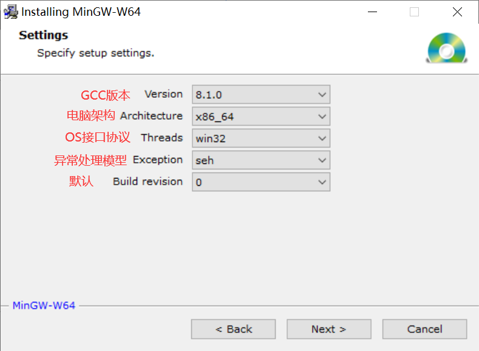

# VSCode

<<<<<<< HEAD
## 中文环境

安装简体中文插件

## 配置 C/C++ 环境
=======
## 安装 VSCode

VSCode 仅仅是一个文本编辑器, 所有功能都要通过插件来扩展

## 安装插件

### 汉化插件

### C/C++ 环境配置

#### 安装编译器

1. 下载 mingw-w64 在线/离线安装包

2. 选好配置

   

3. 添加 bin 目录环境变量

#### 配置 C/C++ 环境

1. 配置**编译器**(`c_cpp_properties.json`)

   Ctrl + Shift + P  命令面板

   Edit Configurations(UI): 编译器路径 + IntelliSense 模式 (gcc-x64)

2. 配置**编译**设置(`tasks.json`)

   Ctrl + Shift + P  命令面板

   Tasks:Configure Default Build Task

   C/C++: g++.exe build active file

3. 配置**调试**设置(`launch.json`)

   工具栏: Debug  --> Start Debugging

   C++(GDB/LLDB)

>>>>>>> 1146d0f0a96c32b58e212c62322d0b9f90f99ebb
