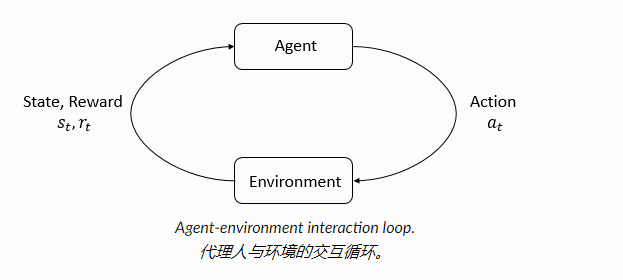

# Introduction to RL


## 关键概念


### 关键概念和术语




agent 观测/部分观测 env 得到状态 s, 并作出动作 a, 环境收到动作影响发生变化到新的状态并给出反馈 r,  agent 的目标是最大化回报.


#### States and Observations

状态 s 是对环境信息的完整描述, 观测 o 是环境信息的部分描述


#### Action Spaces

环境中动作 a 的全集


#### Policies

策略是 agent 决定采取哪个动作 a 的规则

策略的参数用下标 θ 表示


##### Deterministic Policies

确定性策略


##### Stochastic Policies

随机性策略

* categorical policies

  分类策略, 用于离散动作空间

* diagonal Gaussian policies

  对角高斯策略, 用于连续动作空间


对随机策略来说, 两个关键的计算很重要

* 从策略中抽样动作
* 计算具体动作的似然

```
categorical policies 分类策略
```

```
diagonal Gaussian policies 对角高斯策略
```


#### Trajectories

轨迹是状态和动作的序列, 状态转移由环境决定(确定性/随机性)


#### Reward and Return

环境对动作的反馈就是奖励, 奖励的和就是回报


## RL 算法种类


## 策略优化

